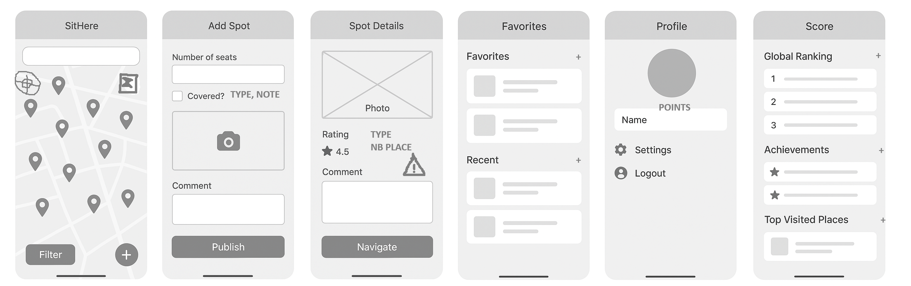
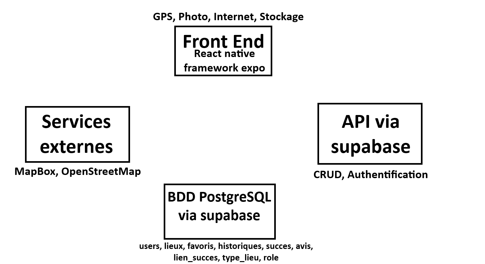

# Welcome to your Expo app 👋

This is an [Expo](https://expo.dev) project created with [`create-expo-app`](https://www.npmjs.com/package/create-expo-app).

## Get started

1. Install dependencies

   ```bash
   npm install
   ```

2. Start the app

   ```bash
   npx expo start
   ```

Application collaborative qui permet de trouver facilement des bancs et des endroits où s’asseoir sur une carte.

[Lien trello}(https://trello.com/invite/b/690def04afcf09d75aa5b712/ATTIe930d4f7c96ab808cfb18539d7b7c544A227EDA5/sithere)





